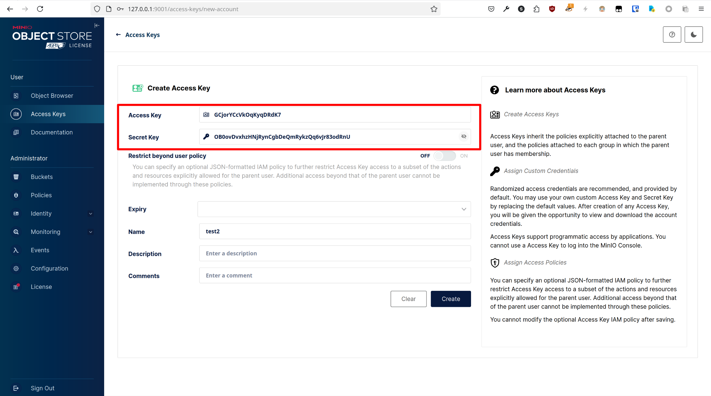

# SwiftJourney 后端

## 调试

### 直接运行（增量构建速度快，需配置环境）

#### 环境要求

- [Rust 工具链 1.86.0+](https://www.rust-lang.org/learn/get-started)

#### 构建后端

（在`backend`目录下执行）

Debug 模式（不启用优化）：`cargo build`
Release 模式（启用优化）：`cargo build --release`

#### 配置依赖服务

所有用于直接运行的依赖服务已经配置在`docker-compose-local.yaml`中

##### 启动依赖服务

```shell
docker compose -f ./docker-compose-local.yaml up
```

##### 配置 MinIO 密钥（只需在第一次启动时配置）

当启动依赖服务，看到类似如下输出时，表示 MinIO 服务已经成功启动：

```text
minio-1     | MinIO Object Storage Server
minio-1     | Copyright: 2015-2025 MinIO, Inc.
minio-1     | License: GNU AGPLv3 - https://www.gnu.org/licenses/agpl-3.0.html
minio-1     | Version: RELEASE.2025-04-22T22-12-26Z (go1.24.2 linux/amd64)
minio-1     |
minio-1     | API: http://172.27.0.3:9000  http://127.0.0.1:9000
minio-1     | WebUI: http://172.27.0.3:9001 http://127.0.0.1:9001
minio-1     |
minio-1     | Docs: https://docs.min.io
```

使用浏览器打开`http://127.0.0.1:9001`，使用`docker-compose-local.yaml`中配置的用户名、密码（默认都为`swiftjourney`）登录

##### 创建 Access Key


记录其中的 Access Key、Secret Key，**点击"Create"**：



打开`./backend/.env`配置文件，将其中的`MINIO_ACCESS_KEY`、`MINIO_SECRET_KEY`替换为上图中的值。

#### 运行后端

（在`backend`目录下执行）

Debug 模式（不启用优化）：`cargo run --bin api`
Release 模式（启用优化）：`cargo build --release --bin api`

后端启动后，将监听`8080`端口。

### Docker 运行（增量构建速度慢，无需配置环境）

#### 编译 Docker 镜像（注意，若修改了后端代码，需要重新编译）

```shell
docker compose build
```

#### 启动后端

```shell
docker compose up
```

#### 配置

##### 配置 MinIO 密钥（只需在第一次启动时配置）

当启动后端 compose，看到类似如下输出时，表示 MinIO 服务已经成功启动：

```text
minio-1     | MinIO Object Storage Server
minio-1     | Copyright: 2015-2025 MinIO, Inc.
minio-1     | License: GNU AGPLv3 - https://www.gnu.org/licenses/agpl-3.0.html
minio-1     | Version: RELEASE.2025-04-22T22-12-26Z (go1.24.2 linux/amd64)
minio-1     |
minio-1     | API: http://172.27.0.3:9000  http://127.0.0.1:9000
minio-1     | WebUI: http://172.27.0.3:9001 http://127.0.0.1:9001
minio-1     |
minio-1     | Docs: https://docs.min.io
```

使用浏览器打开`http://127.0.0.1:9001`，使用`docker-compose.yaml`中配置的用户名、密码（默认都为`swiftjourney`）登录

##### 创建 Access Key


记录其中的 Access Key、Secret Key，**点击"Create"**：


打开`docker-compose.yaml`配置文件，将其中的`MINIO_ACCESS_KEY`、`MINIO_SECRET_KEY`替换为上图中的值。

后端启动后，将监听`8080`端口。
